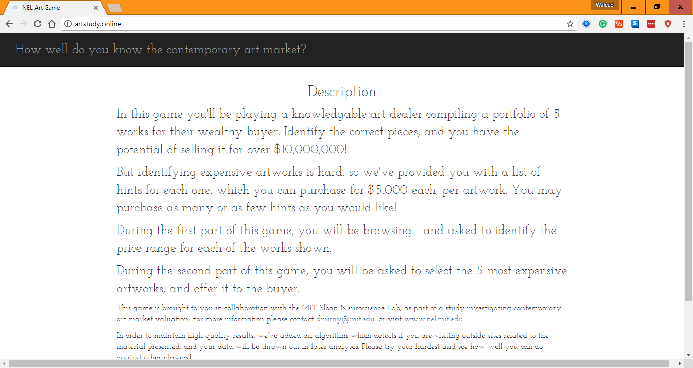
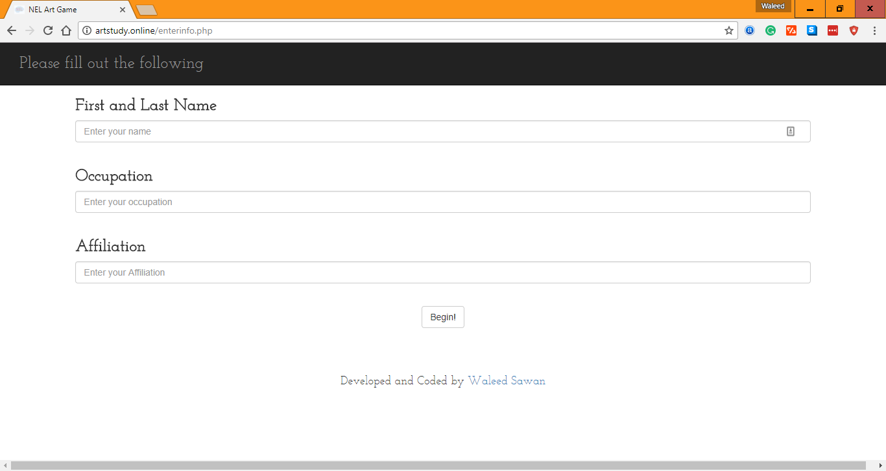
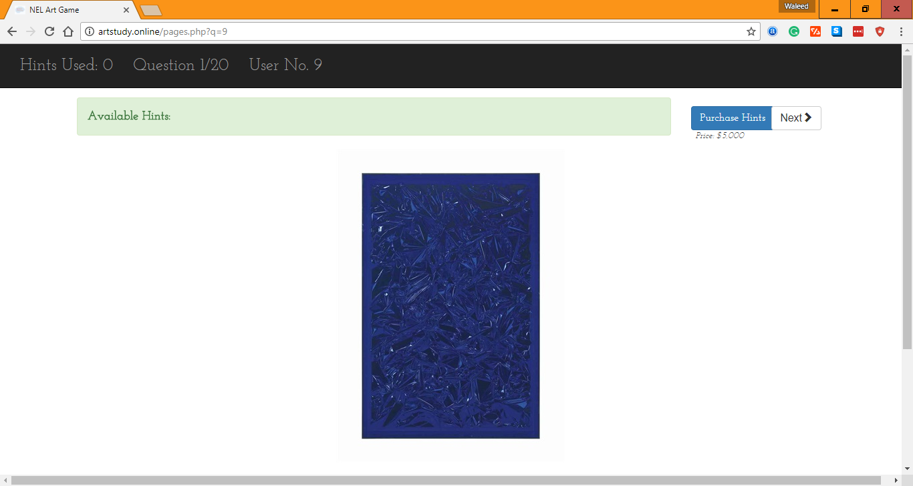
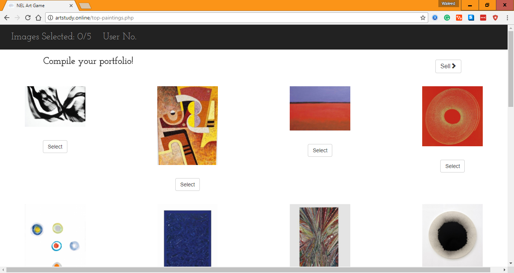
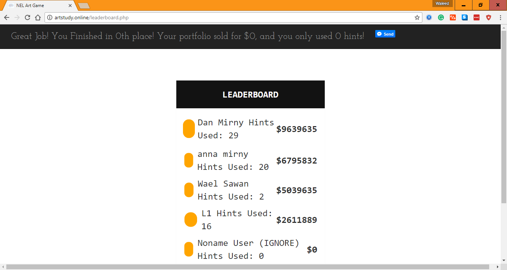
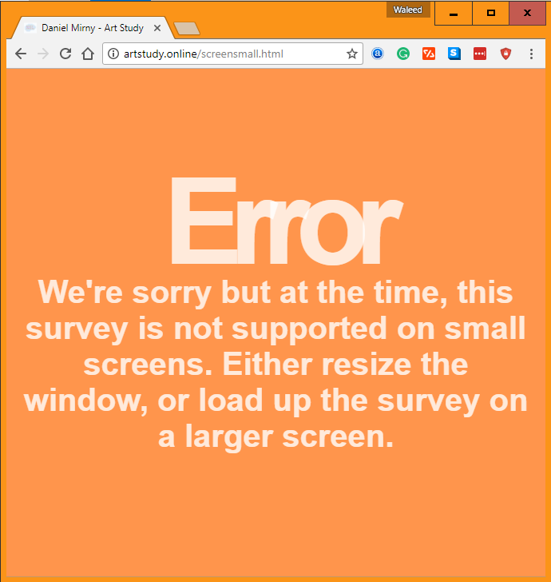

                <link rel="stylesheet" href="https://maxcdn.bootstrapcdn.com/bootstrap/3.3.7/css/bootstrap.min.css">
# NEL-Artstudy

Project done for a Freelancer client. User is supposed to attempt to value the different paintings based on how the look. The user
can also purchase hints for $5,000. The second part of the game is where the user creates their own portfolio and that is used to
rank the user against others. This was created for a MIT Neuroeconomics Lab.

<b>Start of Project:</b> August 1st 
<b>Completion of Project:</b> August 6th 
<b>Languages Used:</b> HTML, CSS, Javascript, jQuery, Bootstrap Framework, React.js, PHP, MySQL

# Some Screenshots:

 <b>Homepage</b>

 <b>User Creation Page</b>

 <b>Part One - Value of Paintings</b>

 <b>Part Two - Creation of Portfolio</b>

 <b>Leaderboard and Score Check</b>

 <b>Error Page - Screen Size</b>

